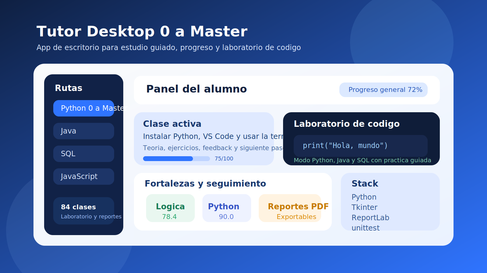

# Tutor Desktop 0 a Master Showcase

Repositorio publico de portafolio para mostrar el proyecto sin exponer el codigo fuente completo.

Ilustracion de showcase basada en los modulos reales del sistema.

## Resumen

Aplicacion de escritorio desarrollada en Python para acompanar rutas de aprendizaje tecnico desde cero hasta un nivel profesional. El sistema organiza clases, practica guiada, laboratorios de codigo y seguimiento del alumno en una sola experiencia de escritorio.

## Lo que hice

- disene una interfaz de escritorio con enfoque didactico
- estructure rutas de estudio por tecnologia
- implemente evaluacion basica por clase y seguimiento de progreso
- agregue laboratorio de codigo con soporte para varios lenguajes
- genere reportes en Markdown y PDF
- prepare empaquetado para distribucion en Windows

## Tecnologias

- Python
- Tkinter
- Pillow
- ReportLab
- unittest

## Capacidades destacadas

- rutas de aprendizaje para Python, Java, SQL, JavaScript, TypeScript, PHP, C y R
- evaluacion de ejercicios con retroalimentacion
- adaptacion del nivel de reto segun avance
- almacenamiento local de progreso por perfil
- exportacion de reportes para seguimiento academico

## Enfoque de portafolio

Este repositorio se publica como showcase para revision profesional. El codigo fuente operativo y el material interno del proyecto no se exponen aqui de forma completa para proteger el trabajo original.

## Que demuestra a una empresa

- diseno de producto educativo
- desarrollo de aplicaciones de escritorio
- organizacion de logica por modulos
- automatizacion de reportes
- capacidad para empaquetar software usable por usuarios finales
